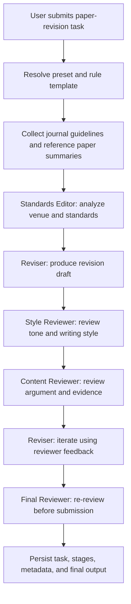

# Phase 10 Context: Academic Paper Revision Mode

## Goal

Complete `paper-revision` as a real Mindforge preset instead of a placeholder. The workflow should help a user revise an academic manuscript by collecting journal/style context, running role-specific revision and review stages, and returning a traceable review-revise-re-review result.

## Scope

- Extend the existing serial orchestration service rather than introduce a separate paper-only runtime.
- Reuse Phase 7 rule templates for role-to-model assignment.
- Add lightweight journal guideline and reference paper context collection.
- Add frontend fields and result panels for academic context.
- Add an OpenAI-compatible model API path for the Ark/Doubao smoke test.

## Flow

## Key Decisions

- Paper mode uses the same `SerialOrchestrationService.execute_preset()` path as code engineering.
- Journal and reference-paper fetching is intentionally lightweight: fetch title and short cleaned page excerpt only.
- The default Phase 10 test model is `doubao-seed-2.0-lite` through Volces Ark, but users can still override role models through rule templates.
- API keys are not stored in the repository; the Ark key is supplied through `ARK_API_KEY`.
