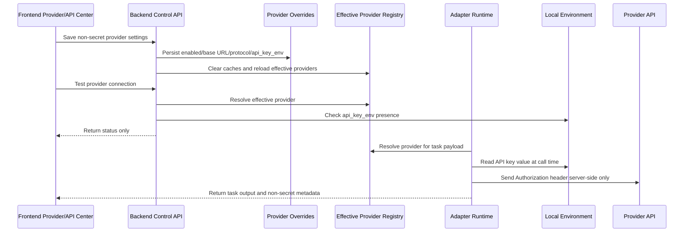

# Phase 11 Context: Provider API Management Center

## Purpose

Phase 11 turns provider setup from static catalog editing into an operator-facing management flow. The user should be able to configure provider connection metadata, verify whether an API key is configured, test connectivity, and then run tasks through the effective provider configuration.

## Existing Foundation

- `app/model_registry/catalog.yaml` defines seed providers, models, routing defaults, provider base URLs, and metadata such as `api_key_env`.
- `app/backend/api/routes/models.py` exposes read-only provider and model discovery.
- `app/backend/api/routes/model_control.py` exposes editable model and rule-template control endpoints under `/api/control`.
- `app/backend/services/model_loader.py` already defines model override loading plus provider override load/save helpers.
- `app/backend/schemas/model.py` already contains provider-control schemas, including provider override entries and connection-test results.
- `app/backend/integration/openhands_adapter.py` uses `OPENHANDS_MODE=model-api`, effective provider config, and `os.getenv(api_key_env)` to call OpenAI-compatible providers.

## Product Direction

Provider/API Center should be the operational home for external model API configuration. It complements, but does not replace, the existing model control center:

- Model Control answers which model is enabled and preferred.
- Provider/API Center answers how a provider is reached and whether its credential is configured.
- Runtime execution must consume the same effective provider view shown in the UI.

## Benchmark Constraints

Phase 11 is also where Mindforge formalizes its benchmark stance:

- Codex and Claude Code define the engineering-agent execution floor: real repository understanding, multi-file edits, tests, explanations, and reviewable delivery.
- OpenHands defines the architecture reference: runtime boundaries, agent/action/observation concepts, skills, and repository instructions.
- Mindforge differentiates above that floor through controllable orchestration: presets, rules, roles, model/provider routing, approvals, history, and paper/development workflows.

Provider/API management supports this direction by making external model execution trustworthy and inspectable instead of hiding credentials and endpoints in local shell state.

## Locked Decisions

- Seed provider definitions remain in `app/model_registry/catalog.yaml`.
- Mutable provider configuration is layered through local overrides, not by rewriting the seed catalog.
- Override files must contain only non-secret values.
- API key values are supplied through environment variables by default.
- Backend APIs report secret configuration status only.
- Frontend displays status only and never accepts or renders plaintext API key values.
- The adapter remains the runtime boundary for external provider calls.

## Security Model

The safe shape for provider configuration is:

```json
{
  "provider_id": "volces-ark",
  "enabled": true,
  "api_base_url": "https://ark.cn-beijing.volces.com/api/coding/v3",
  "protocol": "openai",
  "anthropic_api_base_url": "https://ark.cn-beijing.volces.com/api/coding",
  "api_key_env": "ARK_API_KEY",
  "api_key_configured": true
}
```

The unsafe shape is any payload, file, log, or UI state that contains the actual API key value:

```json
{
  "api_key": "DO_NOT_STORE_OR_RETURN_REAL_KEYS"
}
```

Phase 11 must reject the unsafe shape. If later phases add a local secret store, that store must be ignored by git and treated as local machine state, not project configuration.

## Runtime Relationship



## Implementation Notes for QA

- Prefer tests that assert absence of secret fields, not only happy-path provider behavior.
- Treat `Authorization`, `api_key`, `token`, and provider-specific key names as sensitive in logs and snapshots.
- Connection-test failures should be actionable but sanitized, for example `missing_api_key`, `invalid_base_url`, `upstream_unauthorized`, or `upstream_unreachable`.
- API key env var names are not secrets and may be displayed.
- `api_key_configured` is a derived boolean and should be recalculated server-side.
- Frontend tests should use fake env var names and mocked responses; never use real key-like literals.

## Expected Release Artifact

At the end of Phase 11, the release reviewer should be able to open the web app, visit Provider/API Center, verify provider status, update non-secret settings, run connection checks, execute a task through the selected provider, and confirm through tests and manual review that no API key value is committed or exposed.
