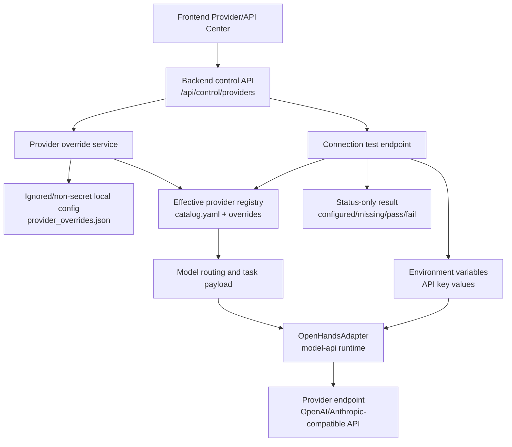

# Phase 11 Plan: Provider API Management Center

## Goal

Build a Provider/API Management Center that lets operators view, configure, and validate model providers without committing or exposing API secrets. Phase 11 connects the frontend Provider/API Center to backend provider-control APIs, persists non-secret provider overrides, and ensures the adapter runtime uses the effective provider configuration.

## User Stories

- As an operator, I can see all configured providers, their enabled state, protocol, base URLs, API key environment variable name, and whether the key is configured.
- As an operator, I can update non-secret provider settings such as enabled state, OpenAI-compatible base URL, Anthropic-compatible base URL, protocol, and API key environment variable name.
- As an operator, I can run a provider connection check and see pass/fail status without seeing the API key value.
- As a task submitter, provider overrides made in the management center affect model routing and `model-api` adapter execution.
- As a maintainer, I can verify that no secret values are committed, logged, returned by API responses, or rendered in the frontend.

## Scope

- Add backend provider-control APIs under the existing `/api/control` surface.
- Layer mutable provider overrides on top of `app/model_registry/catalog.yaml` without editing the seed catalog at runtime.
- Expose provider API configuration in the frontend management center.
- Add connection-test behavior that reports configuration status and upstream reachability only.
- Add backend, frontend, compile, and startup verification for the provider-management path.

## Non-Goals

- Do not build a hosted secret manager in Phase 11.
- Do not persist API key values in repository files, local override JSON, SQLite history, logs, task metadata, or browser storage.
- Do not replace the existing model registry, rule-template, or adapter abstractions.
- Do not add provider writeback to third-party services.

## Architecture Flow

## Backend Acceptance Criteria

- `GET /api/providers` returns effective provider summaries, including `api_base_url`, `protocol`, `anthropic_api_base_url`, `api_key_env`, and boolean `api_key_configured`.
- `GET /api/control/providers` returns editable effective provider state for the management center.
- `PUT /api/control/providers/{provider_id}` persists only non-secret override fields: `enabled`, `api_base_url`, `protocol`, `anthropic_api_base_url`, and `api_key_env`.
- `POST /api/control/providers/{provider_id}/test` checks the effective provider configuration and returns `ProviderConnectionTestResult` with status-only details.
- Provider overrides are layered over `catalog.yaml`; the seed catalog remains the source of default providers.
- Updating provider overrides clears provider/model routing caches so subsequent task execution uses the latest effective configuration.
- Unknown provider IDs and invalid protocols return 4xx responses with actionable, non-secret error messages.
- Adapter runtime reads API key values only from `os.getenv(api_key_env)` or an explicitly ignored local secret store if one is introduced later.

## Frontend Acceptance Criteria

- The Provider/API Center displays provider rows/cards with enabled state, protocol, base URLs, API key env var name, and API key configured status.
- API key values are never displayed, stored in component state, sent to the backend, logged to console, or copied into task metadata.
- Editing provider settings persists through backend control APIs and refreshes the effective provider list.
- The connection-test action shows pass/fail/missing-key state without exposing key contents or Authorization headers.
- Validation prevents empty provider IDs, unsupported protocols, and obviously malformed base URLs from being submitted.
- Existing model control, rule-template, task submission, history, and academic paper revision flows continue to work.

## API Key Security Requirements

- Never commit API key values, bearer tokens, `.env` files with real secrets, or generated secret-store files.
- Backend responses must expose only the env var name and `api_key_configured: true|false`; they must not return the key value or masked substrings.
- Frontend must render only configuration status, such as `Configured` or `Missing`, not plaintext or partially masked secrets.
- Logs, exceptions, task metadata, history records, and test snapshots must not contain Authorization headers or API key values.
- Local development uses environment variables such as `$env:ARK_API_KEY = "<secret>"`.
- If a local secret store is added, it must be ignored by git and must never be used as a source for committed fixtures.
- Provider override files may store non-secret config only, including base URLs, protocol, enabled state, and env var names.

## Test Matrix

| Area | Scenario | Expected Result | Verification |
| --- | --- | --- | --- |
| Backend provider listing | Fetch provider summaries | Effective catalog plus overrides are returned with status-only key config | `python -m pytest -q` |
| Backend provider update | Update enabled/base URL/protocol/env var name | Override persists; seed catalog is unchanged; caches refresh | `python -m pytest -q` |
| Backend validation | Unknown provider or unsupported protocol | 4xx response with no secret data | `python -m pytest -q` |
| Backend connection test | Env var missing | Result is `ok=false`, `api_key_configured=false`, no key value | `python -m pytest -q` |
| Backend connection test | Env var present | Runtime uses env var value; response reports only pass/fail and upstream status | `python -m pytest -q` |
| Adapter runtime | Task executes with provider override | `model-api` uses effective provider base URL, protocol, and key env var | `python -m pytest -q` |
| Frontend display | Provider/API Center loads providers | Shows provider config and key status only | `npm run test` |
| Frontend edit flow | User saves provider settings | PUT request uses non-secret fields and refreshes UI | `npm run test` |
| Frontend connection test | User tests provider | UI shows configured/missing/pass/fail state without secret content | `npm run test` |
| Frontend build | TypeScript and Vite production build | Build succeeds without type errors | `npm run build` |
| Python compile | Import/compile backend package | No syntax errors | `python -m compileall app` |
| Startup smoke | Backend and frontend start locally | Health/API pages are reachable during manual QA | Backend/frontend startup commands in `11-VERIFICATION.md` |
| Secret hygiene | Diff and generated files contain no API key values | No secret literals are present in tracked files or logs | Manual review plus targeted grep before release |

## Release Gate

Phase 11 is releasable only when backend tests, frontend tests, frontend build, Python compile, and local startup smoke checks pass, and the release reviewer confirms that no API key value is committed or visible in API/UI output.
