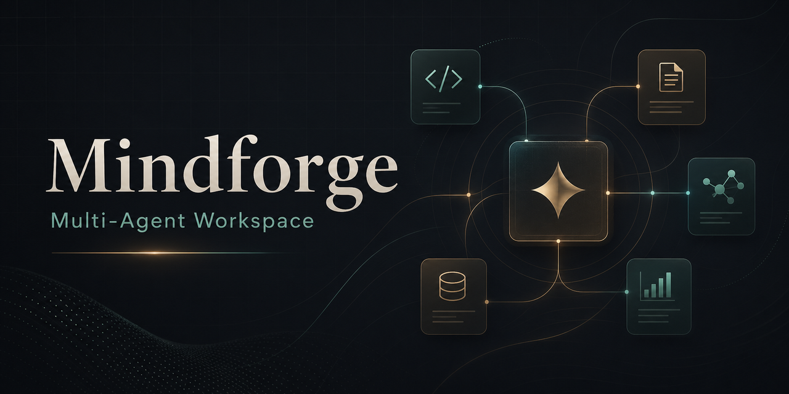

<p align="center">
  
</p>

# Mindforge

> A multi-agent workspace for coding, research writing, model routing, MCP tools, Skills, and exportable AI work products.

Mindforge is an open-source multi-agent assistant workspace. It provides a web app where users can chat with AI, continue context inside one conversation, configure role-based agent teams, manage providers and models, connect Skills and MCP tools, upload files, inspect execution history, and export results as documents.

Mindforge is inspired by OpenHands-style agent architecture. The focus is the product orchestration layer: presets, role assignment, model routing, provider/API management, task history, approval gates, file context, MCP/Skills, and scenario workflows such as code engineering and academic paper revision.

## Highlights

- **Chat-first workspace**: submit tasks like a normal chat and keep follow-up context inside the same conversation.
- **Preset-based agent teams**: use workflows such as default assistant, code engineering, and paper revision with different agent roles.
- **Model control center**: add providers and models, configure priority, disable models, and route roles to different models.
- **Composer model picker**: select the active user-added model directly below the chat input.
- **Skills support**: discover local `SKILL.md` files and inject selected skill instructions into task context.
- **MCP support**: add HTTP JSON-RPC MCP servers, inspect tool catalogs, call tools, and pass selected tool context into tasks.
- **File and web context**: upload parsed files and optionally add web search/page-reading context with citations.
- **Canvas and exports**: edit generated artifacts and export final output to MD, TEX, DOCX, or PDF.
- **Human approval gates**: mark risky tasks for approval before execution.

## Quick Start

Backend:

```powershell
python -m uvicorn app.backend.main:app --host 127.0.0.1 --port 8000
```

Frontend:

```powershell
cd frontend
npm install
npm run dev
```

Open:

- Frontend: `http://127.0.0.1:5173`
- Backend API docs: `http://127.0.0.1:8000/docs`
- Health check: `http://127.0.0.1:8000/api/health`

## Configuration

Model API execution is the default:

```powershell
$env:OPENHANDS_MODE = "model-api"
$env:ARK_API_KEY = "your-local-secret"
$env:VITE_API_BASE_URL = "http://127.0.0.1:8000/api"
```

For adapter development or tests only:

```powershell
$env:OPENHANDS_MODE = "mock"
```

Do not commit real API keys. Use environment variables or the local provider secret store.

## API Areas

- `/api/tasks`: submit chat/task requests.
- `/api/history`: task and conversation history.
- `/api/control`: provider, model, and rule-template management.
- `/api/files`: upload and parse file context.
- `/api/skills`: list local Skills.
- `/api/mcp`: manage MCP servers and tools.
- `/api/artifacts`: export and download MD/PDF/DOCX/TEX artifacts.

## Verification

```powershell
python -m pytest

cd frontend
npm run test
npm run build
```

## Suggested GitHub Topics

`multi-agent`, `ai-agents`, `llm`, `agent-orchestration`, `developer-tools`, `coding-agent`, `openhands`, `mcp`, `model-routing`, `fastapi`, `react`, `typescript`, `openai-compatible`, `academic-writing`, `workflow-automation`

---

# Mindforge 中文说明

> 面向代码工程、论文修改、资料整理和多模型编排的多 Agent Web 工作台。

Mindforge 是一个开源多 Agent 助手。它不是只做“一个聊天机器人”，而是提供一个可配置的工作台：用户可以连续对话、选择模型、创建角色化 Agent 团队、管理 Provider/API、接入 Skills 和 MCP 工具、上传文件、查看历史和审批，并把输出导出为 Markdown、LaTeX、Word 或 PDF。

## 主要能力

- **连续对话**：同一个对话内支持上下文追问。
- **预设模式**：支持默认助手、代码工程、论文修改等不同任务模式。
- **多模型管理**：用户自己添加 Provider 和模型，设置高/中/低/禁用优先级。
- **底部模型选择**：在聊天框下方直接选择本次任务使用的用户模型。
- **Skills 接入**：扫描本机 `SKILL.md`，用户选择后注入任务上下文。
- **MCP 接入**：添加 MCP Server、读取工具目录、调用工具，并把工具目录提供给任务执行链路。
- **文件与联网上下文**：上传 PDF/DOCX/Markdown/代码等文件，也可以开启联网搜索和网页读取。
- **画布与文档导出**：最终输出支持导出 MD、TEX、DOCX、PDF。
- **人工审批**：高风险任务可以先进入审批，再继续执行。

## 适合谁

- 想把 AI 当成一个可配置团队，而不是单个聊天窗口的人。
- 需要不同角色使用不同模型的人，例如协调者、后端、前端、审稿人、论文文风编辑。
- 想把 Agent 的过程变得可观察、可审查、可回放的人。
- 正在做代码工程、论文修改、资料整理、研究写作或多模型工作流的人。

## 架构

- **Frontend**：React + TypeScript Web 工作台。
- **Backend**：FastAPI，负责任务提交、模型路由、MCP、Skills、文件解析、文档导出、审批和历史。
- **Runtime boundary**：`OpenHandsAdapter` 保持底层执行可替换，当前默认走兼容 OpenAI 协议的模型 API。
- **Storage**：SQLite 保存任务和对话历史，本地目录保存上传文件和导出文件。

## 后续方向

- 支持 stdio MCP、本地工具进程托管和工具级审批。
- 增强项目空间、项目级知识库和跨会话记忆。
- 增强 Canvas，支持版本历史、代码预览和更丰富的文档模板。
- 增加 PPTX/XLSX 等更多办公文档格式。
- 增加定时任务、长任务恢复和团队协作能力。

## License

License information has not been finalized yet.
