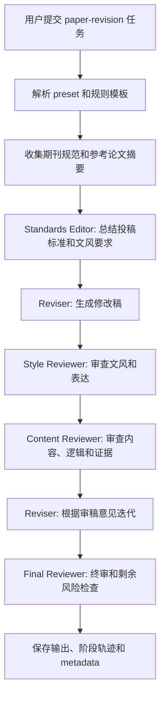

# Mindforge

Mindforge 是一个基于 OpenHands 架构思路二次开发的多 Agent 助手项目。当前仓库不是直接嵌入完整 OpenHands 运行时，而是先保留清晰的 `OpenHandsAdapter` 边界，在其上实现 Mindforge 自己的任务入口、Preset、模型路由、规则模板、审批、历史、GitHub 只读上下文和论文修改模式。

## 当前能力

- Phase 1: FastAPI 后端、统一任务接口、OpenHands adapter 边界。
- Phase 2: YAML Preset 中心和 `/api/presets`。
- Phase 3: `code-engineering` 多角色串行编排。
- Phase 4: 本地仓库扫描和 `repo_analysis` 上下文注入。
- Phase 5: provider/model registry、模型路由、显式模型 override。
- Phase 6: React + Vite Web App 工作台。
- Phase 7: 前端模型控制中心、规则模板、角色到模型分配。
- Phase 8: 审批、SQLite 历史、阶段日志。
- Phase 9: GitHub 仓库、Issue、PR 只读上下文。
- Phase 10: 学术论文修改模式、期刊规范/参考论文上下文、审稿循环、Ark/Doubao OpenAI-compatible 测试通道。
- Phase 11: Provider/API 管理中心、非敏感 provider overrides、API key env 状态、连接测试。

## 标杆约束

- Codex / Claude Code 是工程执行标准：要能读代码库、改多文件、跑测试、解释结果，并交付可审查变更。
- OpenHands 是架构参考：runtime 边界、agent/action/observation、skills、repo instructions。
- Mindforge 是产品编排层：Preset、多 Agent、多模型、多 provider routing、规则模板、审批历史、论文/研发双模式。

## 和 OpenHands 的关系

Mindforge 目前主要学习和复用 OpenHands 的架构方向，而不是把整个 OpenHands runtime 直接搬进来。

- `app/backend/integration/openhands_adapter.py` 是运行时适配边界。
- `mock` 模式用于本地稳定演示。
- `http` 模式保留给 OpenHands-compatible HTTP 服务。
- `model-api` 模式用于 OpenAI-compatible 模型接口测试。
- Preset、规则模板、模型控制、论文修改流程属于 Mindforge 产品层。

后续如果接入真实 OpenHands 服务，Mindforge 应继续保留自己的产品层，把更底层的执行能力逐步切到真实运行时，而不是推倒重写。

## 论文修改流程



`paper-revision` 支持这些输入：

- `journal_name`
- `journal_url`
- `reference_paper_urls`
- `rule_template_id`
- `model_override`
- `role_model_overrides`

默认论文模式现在使用 `doubao-seed-2.0-lite`，并通过 `volces-ark` provider 走 OpenAI-compatible endpoint。

## 本地启动

安装后端依赖：

```powershell
python -m pip install -e .
```

启动后端：

```powershell
powershell -ExecutionPolicy Bypass -File .\scripts\run_local_demo.ps1
```

启动前端：

```powershell
cd .\frontend
npm install
npm run dev
```

默认地址：

```text
Backend: http://127.0.0.1:8000
Frontend: http://127.0.0.1:5173
```

## Ark/Doubao 测试

不要把 API key 写入仓库。只在当前 shell 设置环境变量：

```powershell
$env:ARK_API_KEY = "<your-ark-api-key>"
$env:OPENHANDS_MODE = "model-api"
```

模型配置已经在 `app/model_registry/catalog.yaml` 中注册：

```text
provider: volces-ark
model: doubao-seed-2.0-lite
OpenAI-compatible base URL: https://ark.cn-beijing.volces.com/api/coding/v3
Anthropic-compatible base URL: https://ark.cn-beijing.volces.com/api/coding
```

## 示例请求

提交代码工程任务：

```powershell
$body = @{
  prompt = "Plan backend work for adding login."
  preset_mode = "code-engineering"
  repo_path = "."
} | ConvertTo-Json

Invoke-RestMethod `
  -Method Post `
  -Uri http://127.0.0.1:8000/api/tasks `
  -ContentType "application/json" `
  -Body $body
```

提交论文修改任务：

```powershell
$body = @{
  prompt = "Revise this abstract for a formal journal submission."
  preset_mode = "paper-revision"
  task_type = "writing"
  journal_name = "Example Journal"
  journal_url = "https://journal.example/guidelines"
  reference_paper_urls = @("https://paper.example/reference")
} | ConvertTo-Json

Invoke-RestMethod `
  -Method Post `
  -Uri http://127.0.0.1:8000/api/tasks `
  -ContentType "application/json" `
  -Body $body
```

## 常用 API

- `GET /api/health`
- `POST /api/tasks`
- `GET /api/presets`
- `GET /api/providers`
- `GET /api/models`
- `GET /api/control/models`
- `GET /api/control/providers`
- `PUT /api/control/providers/{provider_id}`
- `POST /api/control/providers/{provider_id}/test`
- `GET /api/control/rule-templates`
- `GET /api/history/tasks`
- `GET /api/history/tasks/{task_id}`
- `GET /api/approvals/pending`
- `POST /api/approvals/{task_id}/approve`
- `POST /api/approvals/{task_id}/reject`
- `GET /api/github/repositories/{owner}/{repo}`
- `GET /api/github/repositories/{owner}/{repo}/issues/{issue_number}`
- `GET /api/github/repositories/{owner}/{repo}/pulls/{pr_number}`

## 测试

```powershell
python -m pytest -q
cd .\frontend
npm run test
npm run build
cd ..
python -m compileall app
```
